# Config Backend : 

1. Tải donent về và chạy file .exe

---
***soure refrence*** : https://dotnet.microsoft.com/en-us/download/dotnet/8.0

---

* Chọn bản  : Window x64 : 

---
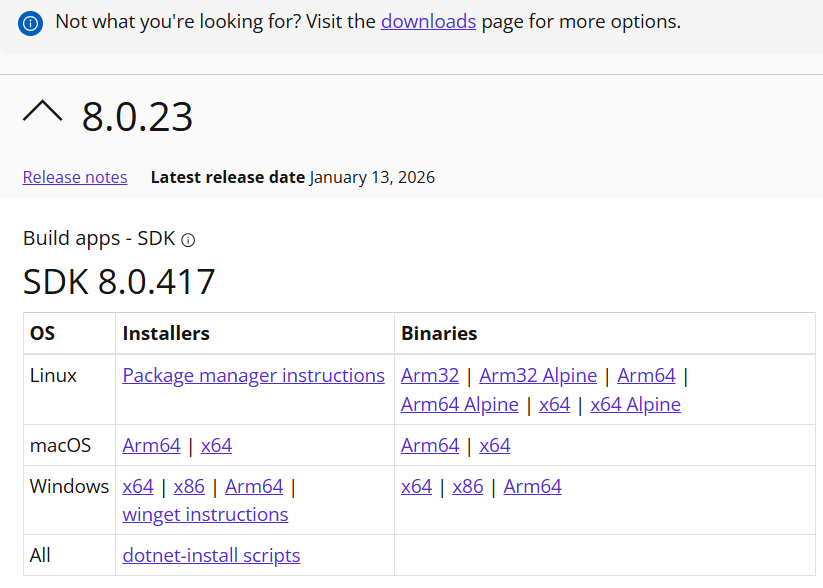

Kiểm tra bằng lệnh trên terminal

```bash
dotnet --info
```

Kết quả : 

---
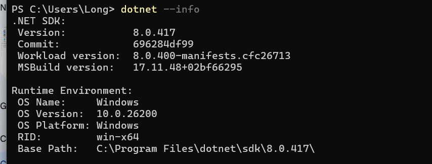.


2. Tải mysql : 

---
***source refrence*** : https://dev.mysql.com/downloads/installer

---

* Tải và config port, admin, password,....

* Thêm vào enviromnent system.

* Kiểm tra đã cài thành công hay chưa : 

--- 
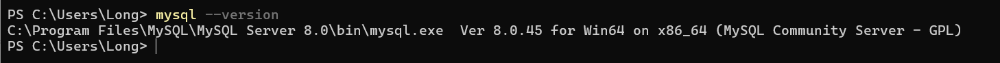

3. Tải và chạy VisualStudio 

--- 

***source refrence*** : https://visualstudio.microsoft.com/thank-you-downloading-visual-studio/?sku=Community&channel=Stable&version=VS18&source=VSLandingPage&passive=false&cid=2500

---


+ Đến bước không tích chọn gì cả và nhấn install: 

---
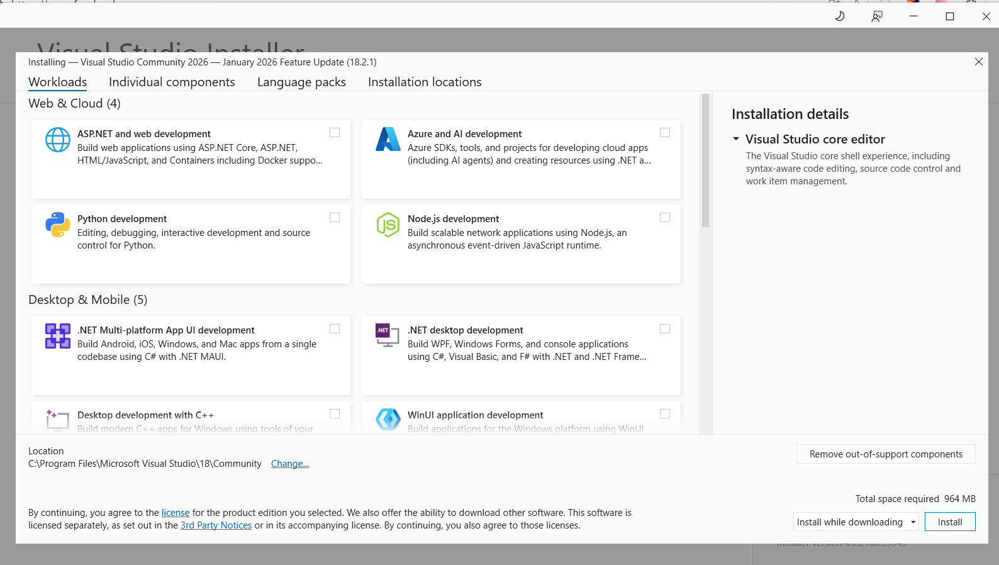


+ Sau đó : ở Insiders chọn more và ấn uninstall và chạy launch bản bên dưới

---
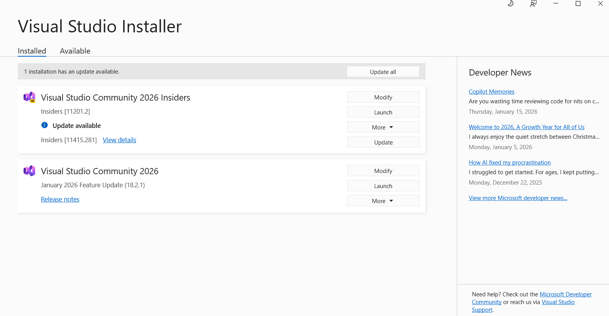

+ Sau đó chọn thư mục backend có file .sln

Mở VisualStudio chọn file sau đó chọn vào file có đuổi .sln VisualStudio sẽ tự động đọc toàn bộ dự án.

---
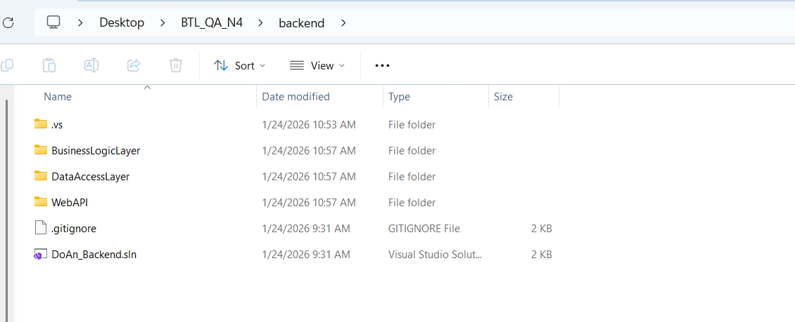


---

+ Chạy và kết nối với database tạo ra database tên DemoDotNet

---

+ Tìm kiếm trong file ***appsettings.json***

---
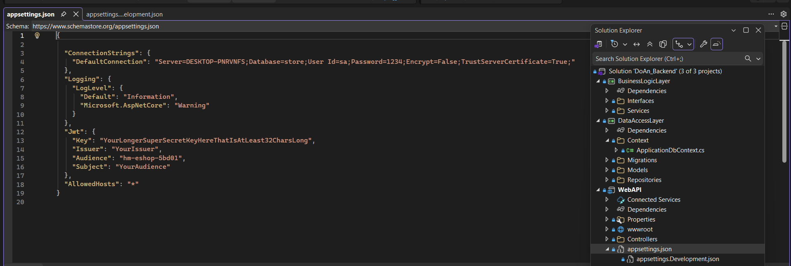

---

**Sửa đoạn "DefaultConnection"** : "MySQLConnectionString": "Server=localhost;Port=3307;Database=DemoDotNet;User=root;Password=NHAP_MAT_KHAU_CUA_BAN_VAO_DAY;"

**Config database user và password ở trên theo đường link**

Kết quả kiểm tra trên máy và database : 

---
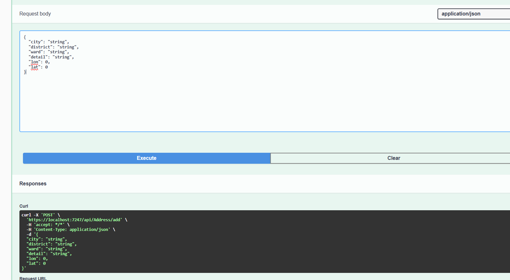

---
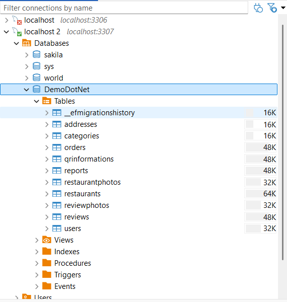

* Test : chạy trên postman curl sau : 


```bash
curl -X 'POST' \
  'https://localhost:7247/api/Address/add' \
  -H 'accept: */*' \
  -H 'Content-Type: application/json' \
  -d '{
  "city": "Hà Nội",
  "district": "Thanh Xuân",
  "ward": "Nguyễn Trãi",
  "detail": "ngõ 150",
  "lon": 30,
  "lat": 40
}'
```


# Phần 2 : Chạy và run thử flutter.

## Cài phiên bản java 17+

1. tìm ip máy tính (tìm ip4)

```bash
ip config
```

2. Trong file **frontend/lib/network/api_util.dart** tìm và sửa ip 

```javascript
String get baseUrl {
    if (kDebugMode) {
      return 'https://172.30.112.1:7247';
    }
    return 'production url';
  }
  ```

  * port xem ở swagger

  * Cài thêm các extension liên quan đến swagger và dart trên VScode.

  3. Cài đặt fluuter sdk 

  ---

  ***source refrence*** : https://docs.flutter.dev/install/archive

  --- 

  * Tải bản stable :
  
  ---
  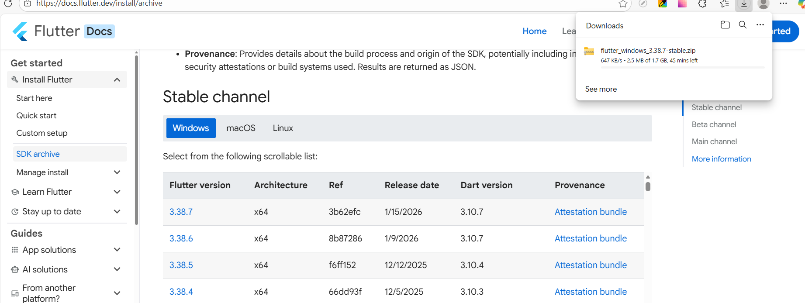

  * Cài đặt và thêm vào biến môi trường (vào thư mục bin của flutter)

  * Kiểm tra bằng lệnh 

  ```bash
  flutter --version
  ```


  3. chạy vào thư mục frontend

  ```bash
  cd frontend
  ```

  * Cài các thư viện :

  ```bash
  flutter pub get
  ```

  4. chỉnh window setting 

---

  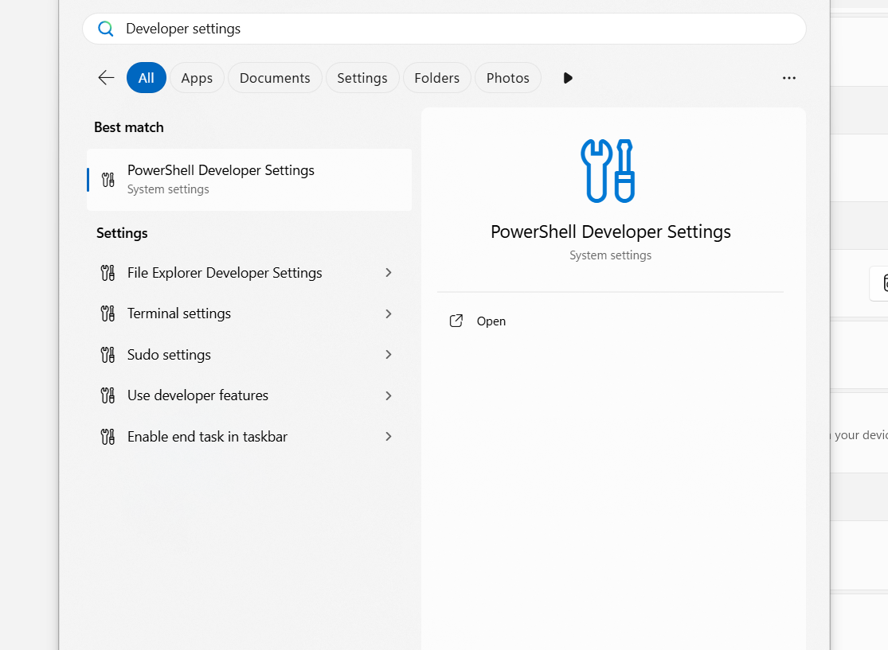

---

* bật chế độ developer

---
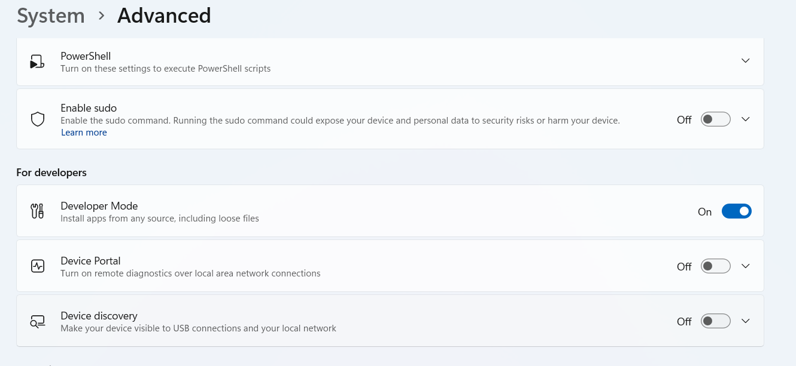

---

* Gõ lệnh 

```bash
flutter devices
```

* Nếu hiện máy bạn => tức là đã thành công và yên tâm chạy chương trình

5. Chạy chương trình bằng lệnh 

```bash
flutter run
```

6. nếu gặp các lỗi  về phiên bản 

* vào ***android/gradle/wrapper/gradle-wrapper.properties.***

thay bằng dòng sau :

```java
distributionUrl=https\://services.gradle.org/distributions/gradle-8.5-all.zip
```

* Mở file android/settings.gradle và thay thế toàn bộ khối plugins { ... } ở cuối file bằng đoạn code sau:

```groovy
// File: android/settings.gradle

plugins {
    id "dev.flutter.flutter-plugin-loader" version "1.0.0"
    
    // NÂNG CẤP: Từ 7.3.0 -> 8.3.0 (Để chạy được với Gradle 8.5)
    id "com.android.application" version "8.3.0" apply false
    
    // NÂNG CẤP: Từ 4.3.15 -> 4.4.1 (Khuyến nghị cho AGP mới)
    id "com.google.gms.google-services" version "4.4.1" apply false
    
    // NÂNG CẤP: Từ 1.7.10 -> 1.9.22 (Để tương thích với AGP 8.3.0)
    id "org.jetbrains.kotlin.android" version "1.9.22" apply false
}

include ":app"
```

* Sửa file android/app/build.gradle

```groovy
// File: android/app/build.gradle

android {
    namespace "com.example.cp_restaurants"
    compileSdkVersion flutter.compileSdkVersion
    ndkVersion flutter.ndkVersion

    compileOptions {
        // SỬA: Nâng lên Java 17
        sourceCompatibility JavaVersion.VERSION_17
        targetCompatibility JavaVersion.VERSION_17
    }

    kotlinOptions {
        // SỬA: Nâng lên Java 17
        jvmTarget = '17'
    }

    // ... (Giữ nguyên các phần khác)
}
```

chạy lại 

```bash
flutter clean
flutter pub get
flutter run
```

* Tìm và sửa trong file ***frontend/android/build.grandle***

```java
ext.kotlin_version = '1.9.22'
```

thêm dòng

```java
subprojects {
    // Định nghĩa logic sửa lỗi namespace
    def fixNamespace = {
        if (project.hasProperty('android')) {
            project.android {
                if (namespace == null) {
                    namespace project.group
                }
            }
        }
    }

    // Kiểm tra thông minh: 
    // Nếu project đã load xong (executed) thì sửa ngay lập tức.
    // Nếu chưa xong thì mới dùng afterEvaluate để chờ.
    if (project.state.executed) {
        fixNamespace()
    } else {
        project.afterEvaluate {
            fixNamespace()
        }
    }
}
```